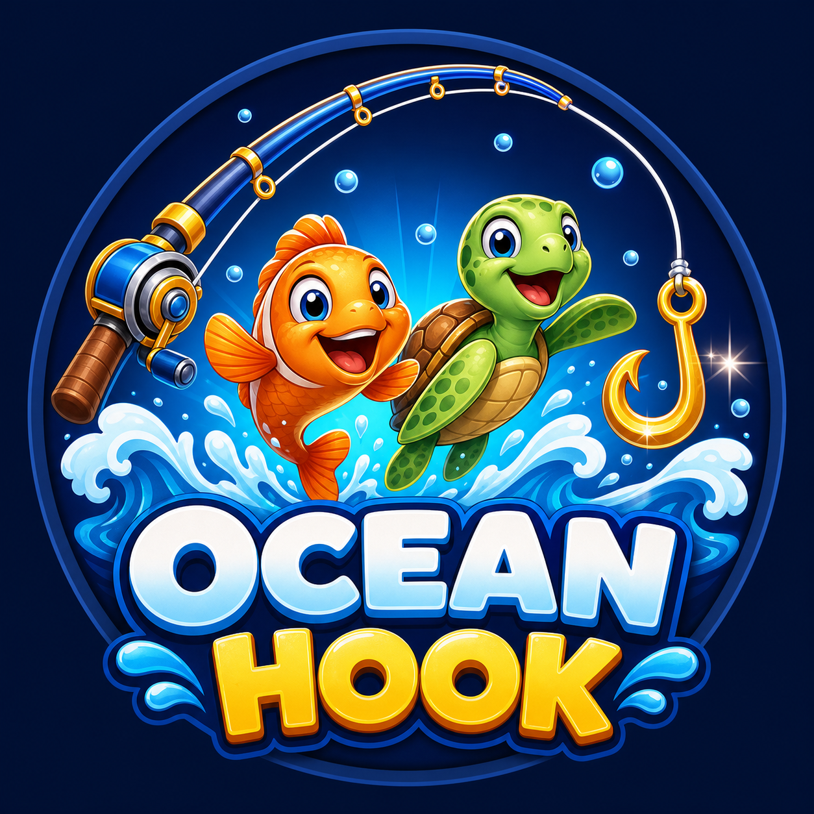

# 🎣 Ocean Hook

---

## About the Game

**Ocean Hook** is a fast-paced, arcade-style fishing game that runs entirely in the browser — no downloads, no installs.

A fishing rod at the top of the screen rotates to follow your mouse. Click anywhere to launch the hook flying in that direction. Fish, turtles, and other sea creatures constantly swim across the water, and your goal is to hook as many **good creatures** as you can while avoiding the **bad ones** (they glow red, so you can't miss them!).

### Rules
- 🐟 **Good sea creatures** (fish, turtles...) → **+1 point**
- 🐡 **Bad creatures** → **−1 heart**
- ❤️ You start with **3 lives**
- 🏆 First to **15 points wins** — lose all your hearts and it's game over!

### Why I Chose This Game
I was inspired by classic arcade fishing mini-games and claw-style games like *Gold Miner*, where one simple input (aim + click) creates surprisingly tense gameplay. I chose this concept because it let me practice the real fundamentals of game development — a proper game loop, sprite-sheet animation, collision detection, state machines, and a bit of trigonometry — using **pure vanilla JavaScript** with zero external libraries. Every mechanic in the game (the rotating rod, the hook's physics, the creature drift) is built from scratch with raw math.

---

## Getting Started

### ▶️ [Play the Game Here](https://maramsshubbar.github.io/ocean-hook/)

### 📋 [Game Plan Document](GAME_PLAN.md)

### How to Play
1. **Move your mouse** — the rod rotates to aim (max ±70° from center).
2. **Click** to cast the hook in that direction.
3. Hook a creature and it gets reeled back in automatically.
4. Green **+1** pops up for good creatures, red **−1 ❤️** for bad ones.
5. Reach **15 points to win** — run out of hearts and you lose!
6. Click **Play Again** to restart instantly.

> **Tip:** The line can't stretch forever — if you miss, the hook reels back empty. Aim where the creature is *going*, not where it is!

---

## Technologies Used

- **HTML5** — page structure and game screens
- **CSS3** — styling, animations (`@keyframes`), Flexbox layouts, glassmorphism (`backdrop-filter`), responsive design (media queries)
- **Vanilla JavaScript (ES6+)** — all game logic:
  - `requestAnimationFrame` game loop with delta-time movement
  - **Canvas API** — creature sprite-sheet animation
  - **SVG** — fishing line and aim line rendering
  - DOM manipulation — HUD, popups, screen switching
- **Git & GitHub** — version control
- **GitHub Pages** — deployment

---

## Next Steps (Stretch Goals)

Planned future enhancements:

- 🔊 **Sound effects & background music** — splash on cast, reel-in sound, win/lose jingles (Web Audio API)
- 📱 **Touch support** — full mobile gameplay with tap-to-cast
- 🏅 **High-score persistence** — save best scores using `localStorage`
- 🐠 **Special golden creature** — rare, fast creature worth +5 points
- ⚡ **Power-ups** — extra heart, slower creatures, widened hook radius
- 📈 **Difficulty levels / endless mode** — speed and spawn rate ramp up over time
- ⏱️ **Timer mode** — score as many points as possible in 60 seconds
- 🌍 **Online leaderboard** — compete with other players